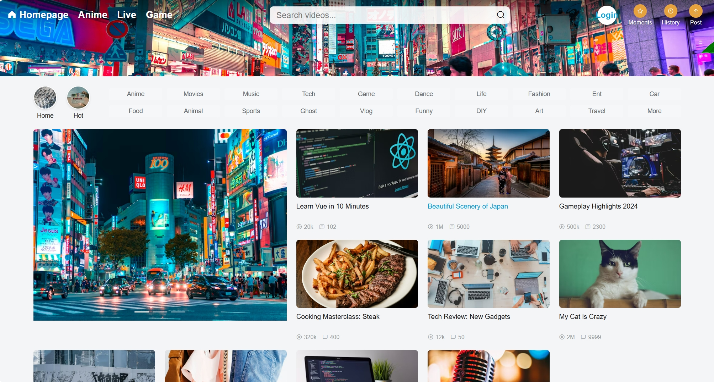
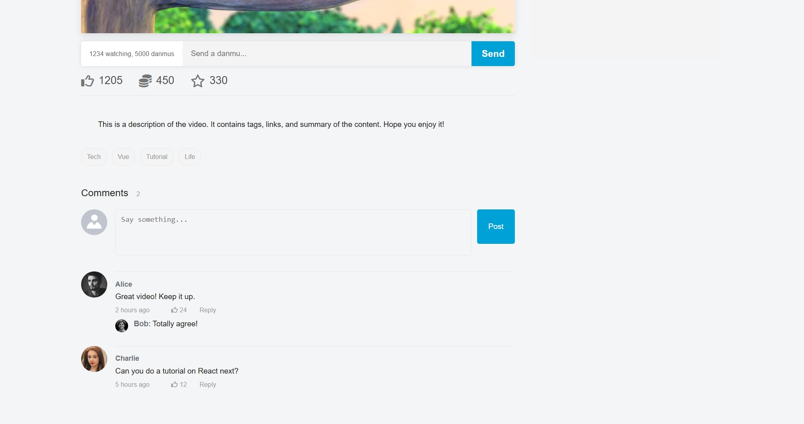

# 🎥 YouTube-Inspired Video Streaming Platform (Frontend)

A high-performance, full-stack video streaming platform frontend with cloud architecture.  
This repository contains the **Frontend source code**, built with **Vue.js 2.x** and **Element UI**.

---

## 📖 Introduction

This project is the frontend interface for a **scalable video streaming ecosystem**, designed to handle **high-concurrency user interactions**, including:

- Real-time danmu (bullet chat)
- Large video uploading
- Social community interactions

The platform aims to replicate the **core experience of YouTube**.  
It connects to a robust **Microservices Backend** (Spring Boot, Spring Cloud, Redis, RocketMQ) capable of supporting **800+ read requests per second** with **low-latency responses**.

---

## ✨ Key Features

### 🎬 Content Consumption

- **Immersive Video Player**
  - Integrated **XGPlayer** for a robust HTML5 playback experience
- **Real-time Danmu (Bullet Chat)**
  - WebSocket-based system for time-synced comments overlaid on videos
- **Smart Recommendations**
  - Homepage carousel and categorized video grids (Anime, Tech, Gaming, etc.)
- **Interactive Controls**
  - Like / Coin / Collect (Triple Action)
  - Follow / Unfollow content creators

---

### 🛠️ Creator Studio

#### Advanced Uploading

- **File Slicing**
  - Client-side chunked upload for large video files
- **MD5 Deduplication**
  - Instant upload by hashing files and checking server-side existence
- **Cover Generation**
  - Automatic thumbnail capture using **HTML5 Canvas**

#### Content Management

- Edit video:
  - Title
  - Tags
  - Description
  - Category

---

### 👤 User Community

- **User System**
  - Secure registration & login via modal dialogs
  - JWT-based authentication
- **Moments (Social Feed)**
  - Post text/image updates
  - View activities from followed creators
- **Watch History**
  - Automatically records watched videos with timestamps
- **Comments**
  - Nested comment system with threaded replies
- **Collections**
  - Organize favorite videos into custom folders

---

## 🛠️ Tech Stack

| Category | Technology | Description |
|--------|-----------|-------------|
| Framework | Vue.js 2.x | Core frontend framework |
| UI Library | Element UI | Desktop UI component library |
| CSS Preprocessor | Less | Scoped and modular styling |
| Video Player | XGPlayer | HTML5 video player with Danmu support |
| Real-time | WebSocket | Live danmu transmission |
| Routing / State | Vue Router & Vuex | SPA routing & centralized state |
| HTTP Client | Axios | RESTful API communication |

---

## 📂 Project Structure

```text
src/
├── api/                     # API request modules
│   ├── videoApi.js
│   ├── userApi.js
│   └── ...
├── assets/                  # Static assets (images, icons)
├── components/              # Reusable Vue components
│   ├── CommonHeader.vue     # Global navigation bar
│   ├── LoginDialog.vue      # Authentication modal
│   ├── PostVideo.vue        # Video upload component
│   ├── VideoComment.vue     # Comment logic
│   └── ...
├── utils/                   # Utility functions
│   ├── fileUtils.js         # File slicing & MD5 calculation
│   └── userUtils.js         # User session helpers
├── views/                   # Page-level components
│   ├── MainPage.vue         # Homepage
│   ├── VideoDetail.vue      # Video player page
│   ├── UserMoments.vue      # Social feed
│   └── UserHistory.vue      # Watch history
├── App.vue
└── main.js
## 📸 Screenshots

### Homepage & Video Player



### Upload Studio & Login


### Comments System


---

