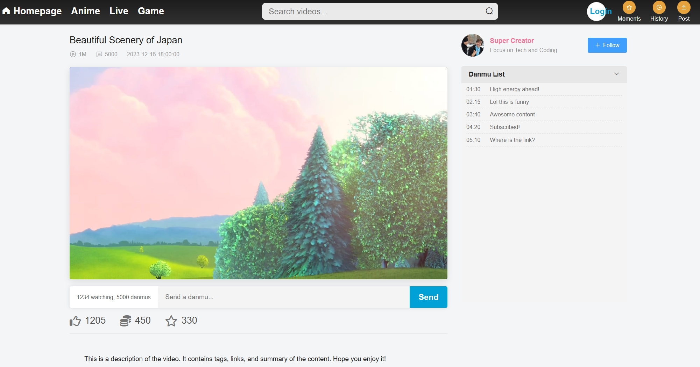

# YouTube-Inspired Video Streaming Platform (Frontend)

A high-performance, full-stack video streaming platform frontend with cloud architecture.  
This repository contains the **Frontend source code**, built with **Vue.js 2.x** and **Element UI**.

---
##  Screenshots & User Workflow

The overall user experience of this platform is inspired by **Youtube**, following a complete workflow of  
**Registration & Login → Content Browsing → User Interaction → Personalized Recommendation**, forming a closed content loop.

---

###  User Registration & Login


- Users start by **registering or logging in** via a modal dialog
- After successful authentication, the backend issues a **JWT token**, which is centrally managed on the frontend
- Login status is required for:
  - Like / Coin / Collect actions
  - Following content creators
  - Posting comments and sending danmu
  - Collecting user behavior data for personalization

---

###  Homepage & Video Browsing


- After login, users enter the homepage, whose layout is inspired by Youtube:
  - Top carousel for recommended or trending content
  - Category-based video feeds (Anime, Tech, Gaming, etc.)
- Users can continuously browse videos, while the system records key behavior signals:
  - Click events
  - Video playback
  - Watch duration

These data points are sent to the backend to support recommendation modeling.

---

###  Video Player & User Interaction



- The video detail page integrates **XGPlayer** for stable HTML5 video playback
- A complete interaction system is provided:
  - 👍 Like
  - 🪙 Coin
  - ⭐ Collect
- **Real-time danmu (bullet comments)**:
  - Implemented using **WebSocket**
  - Precisely synchronized with the video timeline
- All interaction behaviors are logged as important features for personalized recommendations

---

###  Comment System


- The comment system supports:
  - Top-level comments
  - Nested replies (threaded discussions)
- Users can reply to comments, enhancing community engagement
- Comment activity is also incorporated into user interest profiling

---
##  Introduction

This project is the frontend interface for a **scalable video streaming ecosystem**, designed to handle **high-concurrency user interactions**, including:

- Real-time danmu (bullet chat)
- Large video uploading
- Social community interactions

The platform aims to replicate the **core experience of YouTube**.  
It connects to a robust **Microservices Backend** (Spring Boot, Spring Cloud, Redis, RocketMQ) capable of supporting **800+ read requests per second** with **low-latency responses**.

---

##  Key Features

###  Content Consumption

- **Immersive Video Player**
  - Integrated **XGPlayer** for a robust HTML5 playback experience
- **Real-time Danmu (Bullet Chat)**
  - WebSocket-based system for time-synced comments overlaid on videos
- **Smart Recommendations**
  - Homepage carousel and categorized video grids (Anime, Tech, Gaming, etc.)
- **Interactive Controls**
  - Like / Coin / Collect (Triple Action)
  - Follow / Unfollow content creators

---

###  Creator Studio

#### Advanced Uploading

- **File Slicing**
  - Client-side chunked upload for large video files
- **MD5 Deduplication**
  - Instant upload by hashing files and checking server-side existence
- **Cover Generation**
  - Automatic thumbnail capture using **HTML5 Canvas**

#### Content Management

- Edit video:
  - Title
  - Tags
  - Description
  - Category

---

###  User Community

- **User System**
  - Secure registration & login via modal dialogs
  - JWT-based authentication
- **Moments (Social Feed)**
  - Post text/image updates
  - View activities from followed creators
- **Watch History**
  - Automatically records watched videos with timestamps
- **Comments**
  - Nested comment system with threaded replies
- **Collections**
  - Organize favorite videos into custom folders

---

##  Tech Stack

| Category | Technology | Description |
|--------|-----------|-------------|
| Framework | Vue.js 2.x | Core frontend framework |
| UI Library | Element UI | Desktop UI component library |
| CSS Preprocessor | Less | Scoped and modular styling |
| Video Player | XGPlayer | HTML5 video player with Danmu support |
| Real-time | WebSocket | Live danmu transmission |
| Routing / State | Vue Router & Vuex | SPA routing & centralized state |
| HTTP Client | Axios | RESTful API communication |

---

##  Project Structure

```text
src/
├── api/                     # API request modules
│   ├── videoApi.js
│   ├── userApi.js
│   └── ...
├── assets/                  # Static assets (images, icons)
├── components/              # Reusable Vue components
│   ├── CommonHeader.vue     # Global navigation bar
│   ├── LoginDialog.vue      # Authentication modal
│   ├── PostVideo.vue        # Video upload component
│   ├── VideoComment.vue     # Comment logic
│   └── ...
├── utils/                   # Utility functions
│   ├── fileUtils.js         # File slicing & MD5 calculation
│   └── userUtils.js         # User session helpers
├── views/                   # Page-level components
│   ├── MainPage.vue         # Homepage
│   ├── VideoDetail.vue      # Video player page
│   ├── UserMoments.vue      # Social feed
│   └── UserHistory.vue      # Watch history
├── App.vue
└── main.js
```

###  Personalized Recommendation

- Personalized recommendations are generated based on multiple user behavior signals, including:
  - Browsing and watch history
  - Likes / Coins / Collections
  - Follow relationships
  - Comment and danmu activity
- The backend recommendation service leverages **Redis** and **message queues** to handle high concurrency
- The frontend dynamically renders recommended video feeds, enabling:
  - A *“the more you watch, the better it gets”* experience
  - Recommendation behavior similar to **YouTube**

---

> This workflow forms a complete feedback loop:  
> **Login → Browse → Interact → Behavior Collection → Personalized Recommendation → Browse Again**

